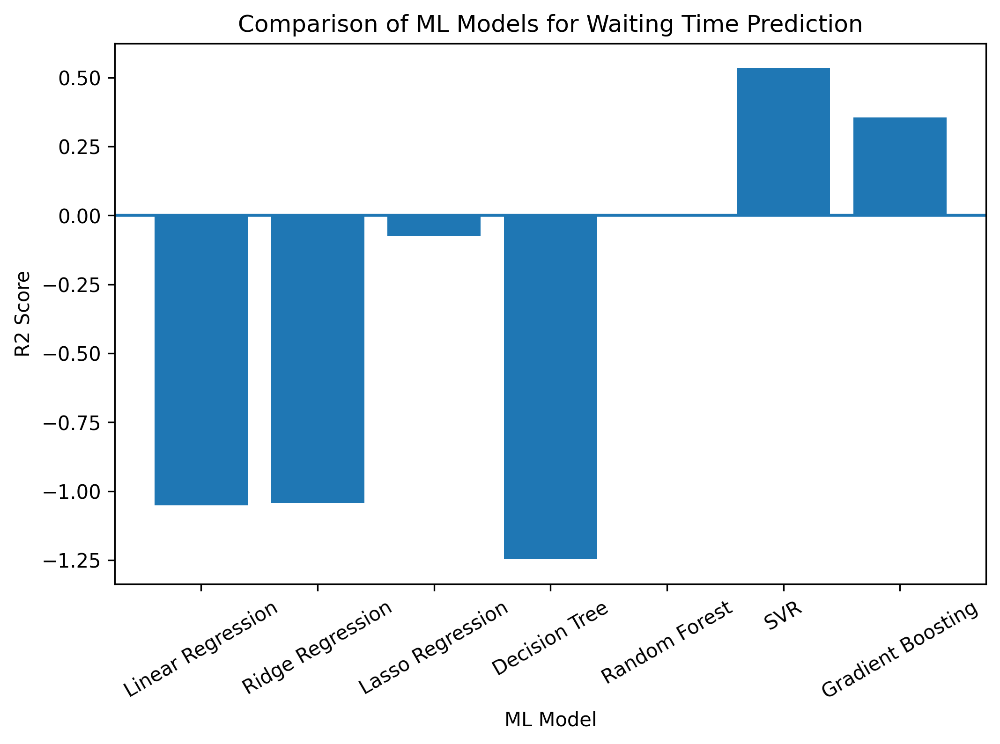
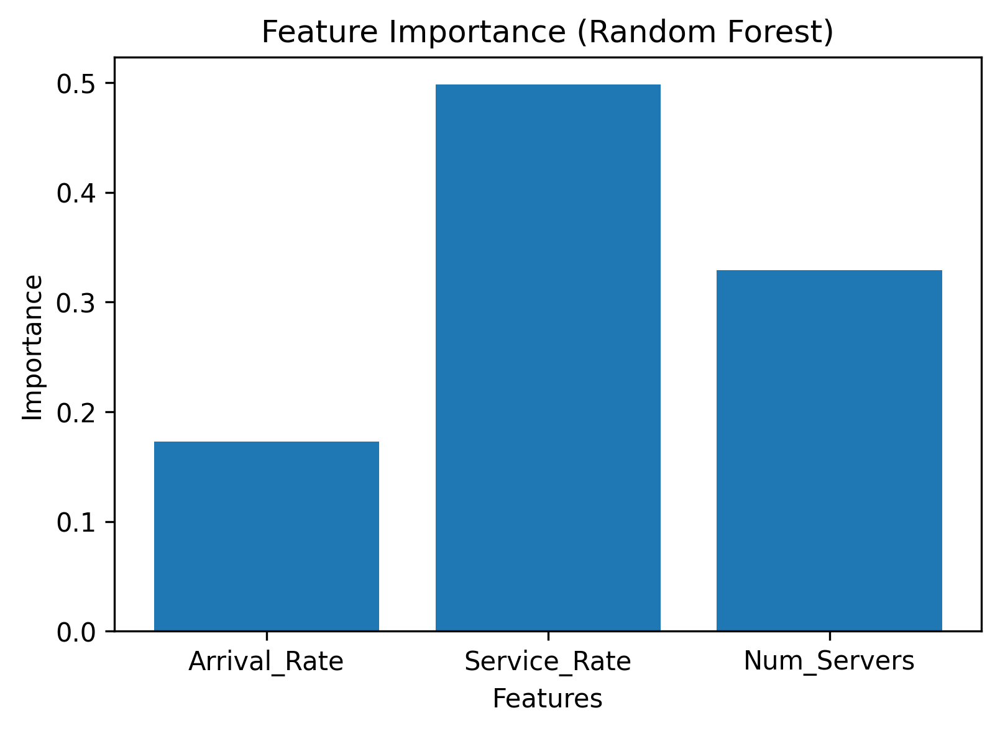

# Data Generation using Modelling and Simulation for Machine Learning

This repository is created as a submission for **Assignment-6 (UCS654)**.

**Submitted by:**
- **Name:** Shivam Kumar
- **Roll Number:** 102303881
- **SubGroup:** 3C63

---

## Objective

The objective of this assignment is to generate synthetic data using a
modelling and simulation approach and evaluate multiple machine learning
models on the generated dataset.

---

## Simulation Tool Used

**SimPy** – an open-source Python-based discrete-event simulation library.

SimPy was used to simulate a bank queue service system where customers arrive
randomly and are served by a limited number of service counters. The simulation
generates realistic performance metrics such as average waiting time.

---

## Simulation Parameters

For each simulation run, the following parameters were randomly varied:

- Arrival Rate  
- Service Rate  
- Number of Servers  

**Target Variable:**  
Average Waiting Time

A total of **1000 simulation runs** were performed.

---

## Generated Dataset

The generated simulation dataset is stored in:

- `simulation_data.csv`

Each row corresponds to one simulation run with its input parameters and
the resulting average waiting time.

---

## Machine Learning Models Used

The following regression models were trained and evaluated:

- Linear Regression  
- Ridge Regression  
- Lasso Regression  
- Decision Tree Regressor  
- Random Forest Regressor  
- Gradient Boosting Regressor  
- Support Vector Regression (SVR)  

The comparison metrics were saved in:

- `results.csv`

---

## Model Performance Comparison

### R² Score Comparison

The following graph compares the R² scores of all models:

---

## Feature Importance Analysis

Feature importance was extracted using the **Random Forest** model to
identify the most influential simulation parameters affecting the average
waiting time:

---

## Final Result

From the comparative analysis, non-linear models such as **Support Vector
Regression** and ensemble-based methods performed better than linear models,
highlighting their effectiveness in capturing the complex and stochastic
nature of simulation-generated queueing data.

---

## License

MIT License  
Copyright (c) 2026 Shivam Kumar
